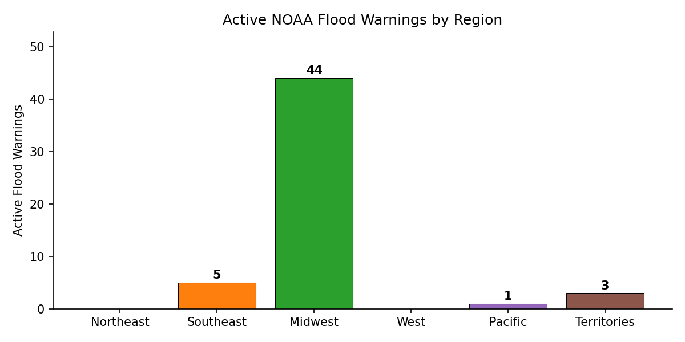

# 🌊 Flood Warning Monitor

> Auto-generated by [daily-update workflow](../.github/workflows/daily-update.yml).
> **Last checked:** 2026-05-03 09:01 UTC

## Summary

| Metric | Value |
|--------|-------|
| Active Flood Warnings | **39** |
| NWM Operational Status | Degraded (HTTP 400) |
| States Affected | 11 |

## Regional Distribution

| Region | Warnings |
|--------|----------|
| Northeast | 0 |
| Southeast | 5 |
| Midwest | 44 |
| West | 0 |
| Pacific | 1 |
| Territories | 3 |

## Top States

| State | Warnings |
|-------|----------|
| IL | 20 |
| MO | 9 |
| IN | 7 |
| WI | 6 |
| TX | 3 |
| MS | 2 |
| LA | 2 |
| MI | 1 |
| AR | 1 |
| MN | 1 |

---
*Data source: [NOAA Weather Alerts API](https://api.weather.gov/alerts/active?event=Flood+Warning)*
