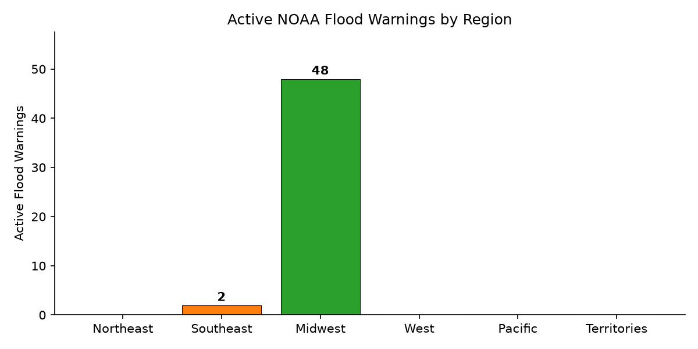

# 🌊 Flood Warning Monitor

> Auto-generated by [daily-update workflow](../.github/workflows/daily-update.yml).
> **Last checked:** 2026-08-05 09:23 UTC

## Summary

| Metric | Value |
|--------|-------|
| Active Flood Warnings | **4** |
| NWM Operational Status | Degraded (HTTP 400) |
| States Affected | 2 |

## Regional Distribution

| Region | Warnings |
|--------|----------|
| Northeast | 0 |
| Southeast | 0 |
| Midwest | 0 |
| West | 0 |
| Pacific | 2 |
| Territories | 2 |

## Top States

| State | Warnings |
|-------|----------|
| TX | 2 |
| AK | 2 |

---
*Data source: [NOAA Weather Alerts API](https://api.weather.gov/alerts/active?event=Flood+Warning)*
