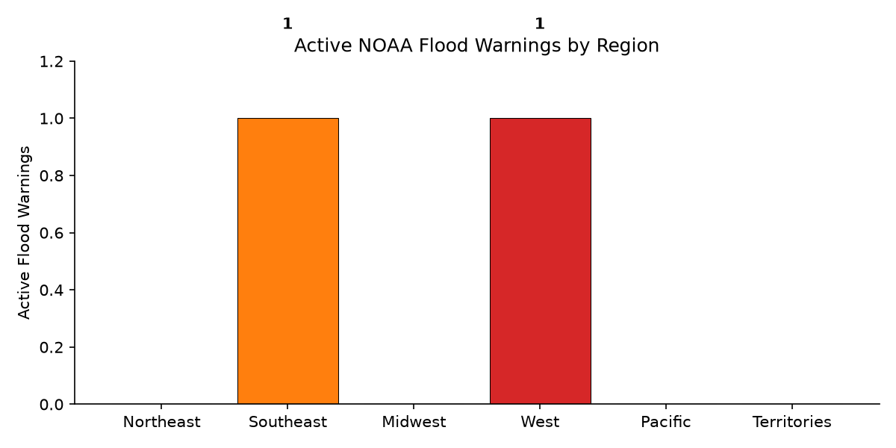

# 🌊 Flood Warning Monitor

> Auto-generated by [daily-update workflow](../.github/workflows/daily-update.yml).
> **Last checked:** 2026-10-22 08:42 UTC

## Summary

| Metric | Value |
|--------|-------|
| Active Flood Warnings | **3** |
| NWM Operational Status | Degraded (HTTP 400) |
| States Affected | 3 |

## Regional Distribution

| Region | Warnings |
|--------|----------|
| Northeast | 0 |
| Southeast | 2 |
| Midwest | 0 |
| West | 1 |
| Pacific | 0 |
| Territories | 0 |

## Top States

| State | Warnings |
|-------|----------|
| FL | 1 |
| GA | 1 |
| UT | 1 |

---
*Data source: [NOAA Weather Alerts API](https://api.weather.gov/alerts/active?event=Flood+Warning)*
